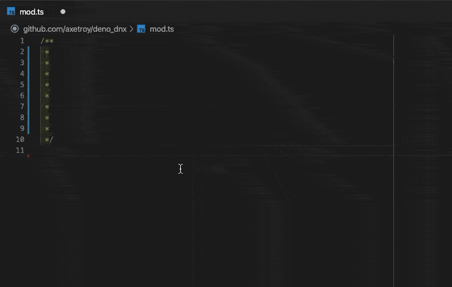
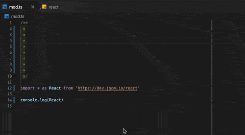
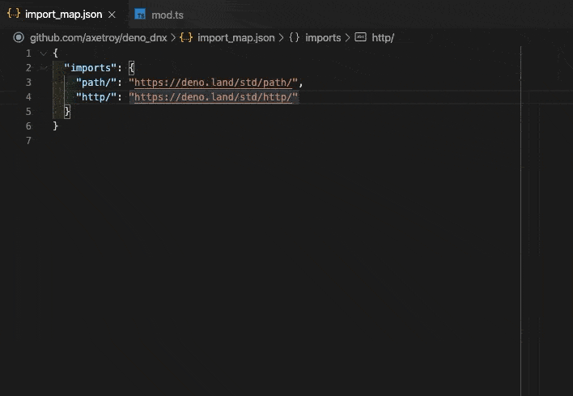

[English](README.md) | 中文简体

<div align="center">

# Visual Studio Code Deno extension


[](https://coveralls.io/github/axetroy/vscode-deno?branch=refs/heads/master)
[](https://deepscan.io/dashboard#view=project&tid=6484&pid=9924&bid=132500)


添加 Visual Studio Code 对 Deno 的支持.


</div>

特性:

<details><summary>Deno 的智能提示</summary>



</details>

<details><summary>模块导入自动补全</summary>


</details>

<details><summary>支持加载 ES 模块</summary>



</details>

<details><summary>代码诊断和快速修复</summary>


</details>

<details><summary>可选的 Deno 内置的格式化工具</summary>


</details>

<details><summary>基于 LSP 的 C/S 架构模型</summary>

该扩展使用 LSP 分离出 客户端/服务端

这意味着复杂的工作处理将会在服务端运行

扩展不会让你的 Visual Studio Code 变慢


</details>

<details><summary>支持 `Import Maps` 的模块导入</summary>



</details>

<details><summary>支持外部的类型声明</summary>

该扩展支持以下方式加载外部声明的文件

> 这些方式都被 Deno 支持

1. 编译注释

```ts
// @deno-types="./foo.d.ts"
import * as foo from "./foo.js";
```

查看 [示例](/examples/compile-hint/mod.ts)

2. `三斜杠`引用指令

```ts
/// <reference types="https://raw.githubusercontent.com/date-fns/date-fns/master/typings.d.ts" />

import { format } from "https://deno.land/x/date_fns/index.js";

format(new Date(), "yyyy/MM/DD");
```

查看 [示例](/examples/react/mod.tsx)

3. `X-TypeScript-Types` 自定义返回头

```ts
import { array } from "https://cdn.pika.dev/fp-ts";

const M = array.getMonoid<number>();
console.log("concat Array", M.concat([1, 2], [2, 3]));
```

</details>

<details><summary>Deno 版本管理的集成</summary>

我已经写了一个 Deno 的版本管理工具 [github.com/axetroy/dvm](https://github.com/axetroy/dvm)

我推荐你使用它进行版本管理

</details>

## 使用方式

1. 从 [Visual Studio Marketplace](https://marketplace.visualstudio.com/items?itemName=axetroy.vscode-deno) 下载并启用扩展

2. 为你的 Deno 项目启用扩展:

   在 Deno 的项目目录中创建文件 `.vscode/settings.json`:

   ```json5
   // .vscode/settings.json
   {
     "deno.enable": true,
   }
   ```

3. Enjoy!

## 配置

- `deno.enable` - 是否启用扩展. 默认值 `false`

- `deno.import_map` - Import Map 的文件路径. 默认值 `null`

- `deno.unstable` - 是否启用 Deno 的不稳定模式. 默认值 `false`

我们不推荐你在全局配置中配置他们。而应该在项目目录的 `.vscode/settings.json` 文件中

```json5
// .vscode/settings.json
{
  "deno.enable": true,
  "deno.import_map": "./path/to/import_map.json",
  "deno.unstable": false,
}
```

扩展也提供了 Deno 的格式化工具，通过在 `.vscode/settings.json` 中设置

```json5
// .vscode/settings.json
{
  "[typescript]": {
    "editor.defaultFormatter": "axetroy.vscode-deno",
  },
  "[typescriptreact]": {
    "editor.defaultFormatter": "axetroy.vscode-deno",
  },
}
```

## 参与贡献

跟随以下步骤参与贡献，社区的发展需要您的力量

1. Fork 项目

2. 克隆到您的电脑中:

   ```bash
   $ git clone https://github.com/your_github_name/vscode-deno.git
   $ cd vscode-deno
   $ yarn # or npm install
   ```

3. 如果你之前已经安装并启用了扩展，请先禁用

4. 开始调试扩展

   打开 Visual Studio Code, 在侧边栏找到 `Run` 项后运行 `Launch Client` 任务

   然后等待 Visual Studio Code 调试器打开新窗口

5. 试试在 Visual Studio Code 中更新扩展的代码，然后重新运行任务

6. 最后, 把最新的代码推送到您的分支，然后发起一个 PR

## 致谢

这个项目最初是 [justjavac/vscode-deno](https://github.com/justjavac/vscode-deno) 的一个分支, 感谢他们的贡献。

## 开源许可

The [MIT License](LICENSE)
